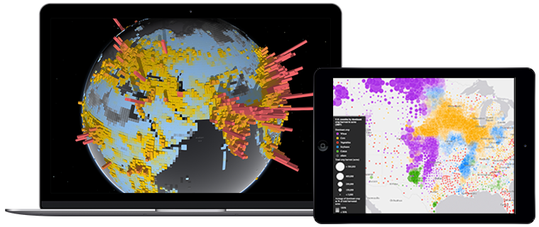

<!-- .slide: data-background="img/2019/devsummit/bg-1.png" data-background-size="cover" style="padding-left: 80px;" -->

<h1 style="text-align: left; font-size: 80px;">Building Ambitious Web Applications Integrated with ArcGIS Online / Portal</h1>
<h2 style="text-align: left; font-size: 1.5em">Maps</h2>
<p style="text-align: left; font-size: 30px;">Tom Wayson</p>
<p style="text-align: left; font-size: 30px;"><a href="https://github.com/tomwayson/">@tomwayson</a></p>
    <p style="text-align: left; font-size: 30px;">slides: <a href="https://bit.ly/2H3143h"><code>https://bit.ly/2H3143h</code></a></p>

---

<!-- .slide: data-background="img/2019/devsummit/bg-4.png" -->

  <h3>Follow Along</h3>
  <p>
    <a href="https://bit.ly/2H3143h" target="_blank">https://bit.ly/2H3143h</a>
  </p>
  <p>
    <a href="https://github.com/tomwayson/devsummit-2019/" target="_blank">@tomwayson/devsummit-2019</a>
  </p>

---

<!-- .slide: data-background="img/2019/devsummit/bg-6.png" -->

<h3>Esri's 2 JavaScript mapping libraries</h3>
<div style="width: 900px; margin: 0 auto; display: flex; justify-content: space-around">
  <div style="width: 450px">
    <a href="https://developers.arcgis.com/javascript/" target="_blank" style="color: #373288">
      <div></div>
      <span>ArcGIS API for JavaScript</span>
    </a>
  </div>
  <div style="width: 450px">
    <a href="http://esri.github.io/esri-leaflet/" target="_blank" style="color: #949494">
      <div></div>
      <span>esri-leaflet</span>
    </a>
  </div>
</div>

---

<!-- .slide: data-background-color="#373288" -->

<h3 style="font-size: 1.6em"> 3D, geom engine, smartmapping</h3>

---

<!-- .slide: data-background-color="#373288" -->

<h3 style="font-size: 1.6em"> web maps, analysis services</h3>

---

<!-- .slide: data-background="img/wayson/phone-16981803257_4bcd3c45dc_z.jpg" -->
<h4> Lightweight / mobile friendly</h4>

---

<!-- .slide: data-background="img/2019/devsummit/bg-2.png" data-transition="slide-in fade-out" -->
<h3>esri-leaflet: framework friendly</h4>
<div>
  
  
  
  
</div>

---

<!-- .slide: data-background="img/2019/devsummit/bg-2.png" data-transition="fade-in slide-out" -->
<h3>ArcGIS: can be a challenge to integrate</h4>
<div>
  
  
  
  
</div>

---

<!-- .slide: class="white" data-background="img/wayson/dojo-betamax.jpg" -->

Note:
https://www.flickr.com/photos/124076687@N04/15104547929

---

<!-- .slide: data-background="img/2019/devsummit/bg-2.png" -->
<h3>Module loading <a href="https://github.com/Esri/jsapi-resources/tree/master/frameworks" target="_blank">solutions</a></h4>
<div>
  
  
  
  
  
  
</div>

---

<!-- .slide: data-background="img/2019/devsummit/bg-4.png" data-transition="fade" -->
<h3>Are you:
<ol>
  <li class="fragment">Using [webpack](https://webpack.js.org/)?</li>
  <li class="fragment">Using ArcGIS API >= 4.7?</li>
  <li class="fragment">Able to configure webpack?</li>
</ol>

---

<!-- .slide: data-background="img/2019/devsummit/bg-2.png" data-transition="fade" -->
<h3>Try [@arcgis/webpack-plugin](https://github.com/Esri/arcgis-webpack-plugin)</h3>
<div>
  
  
  
  
  
  
</div>

---

<!-- .slide: data-background="img/2019/devsummit/bg-3.png" data-transition="fade" class="code-lg" -->
<h3>Using [@arcgis/webpack-plugin](https://github.com/Esri/arcgis-webpack-plugin)</h3>

```js
import Map from 'esri/Map'
import MapView from 'esri/views/MapView';

var map = new Map({ basemap: "streets" });
var view = new MapView({
  container: "viewDiv",
  map: map
});
```
<p>Let's you use ArcGIS API like any other library 🎉</p>

---

<!-- .slide: data-background="img/2019/devsummit/bg-2.png" data-transition="fade" -->
### For everyone else, there's [esri-loader](https://github.com/Esri/esri-loader)

<div>
  
  
  
  
  
  
  
</div>

---

<!-- .slide: data-background="img/2019/devsummit/bg-3.png" class="code-lg" -->
### Using <a href="https://github.com/Esri/esri-loader" target="_blank">esri-loader</a>:

```js
import { loadModules } from 'esri-loader'

loadModules([
  'esri/views/MapView',
  'esri/WebMap'
]).then(([MapView, WebMap]) => {
  // use MapView and WebMap as normal
})
```

---

<!-- .slide: data-background="img/wayson/shrug-2799746255_436723e65c_z.jpg" -->
  <h4>Which is right for _our_ use case?</h4>

---

<!-- .slide: data-background="img/2019/devsummit/bg-2.png" -->
### Advanced mapping capabilities?


Not really...<span class="fragment"> but let's pretend</span>

---

<!-- .slide: data-background="img/2019/devsummit/bg-2.png" -->
### Framework: Ember


<a href="https://github.com/Esri/jsapi-resources/tree/master/frameworks/ember" target="_blank">Lot's of resources</a>

---

<!-- .slide: data-background="img/2019/devsummit/bg-2.png" -->
<h3>We'll use <a href="https://github.com/Esri/ember-esri-loader" target="_blank">ember-esri-loader</a></h4>
<div>
  
  
  
</div>

---

<!-- .slide: data-background="img/wayson/Backlit_keyboard.jpg" -->

<h4>Let's <a href="https://github.com/mjuniper/ambitious-arcgis-app-2019/blob/master/workshop/5-maps.md" target="_blank">make a map!</a></h4>
